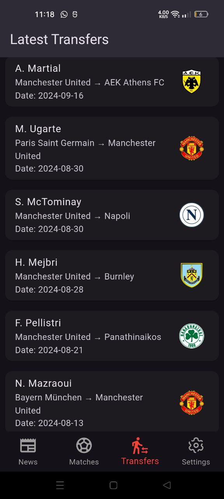
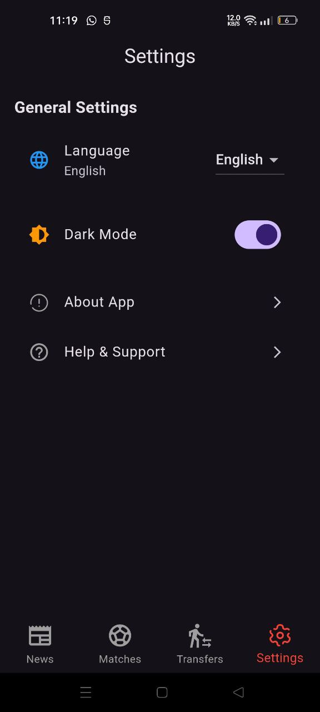

# ⚽ Elkaweer - Football News & Transfers App  

Elkaweer is a football news app that provides the latest football transfers, live scores, and match updates.  

## 📸 Screenshots  

Here are some screenshots of the app in action:  

  
  
  
  
  

## 🚀 Features  

✅ Latest football news from NewsAPI.org  
✅ Live match scores using API-FOOTBALL  
✅ Transfer updates with team and player details  
✅ Dark mode for better user experience  
✅ Multi-language support (English & Arabic)  

## 🔧 Installation  

1. Clone the repository:  
   `git clone https://github.com/MoShehata7920/elkaweer`

2. Navigate to the project folder:
`    cd elkaweer`

3. Install dependencies:
`    flutter pub get`

4. Run the app
`    Run the app`

📦 Dependencies
    - provider for state management
    - http for API requests
    - intl for date formatting
    - flutter_localizations for multi-language support

📄 License
    This project is licensed under the MIT License - see the LICENSE file for details.

