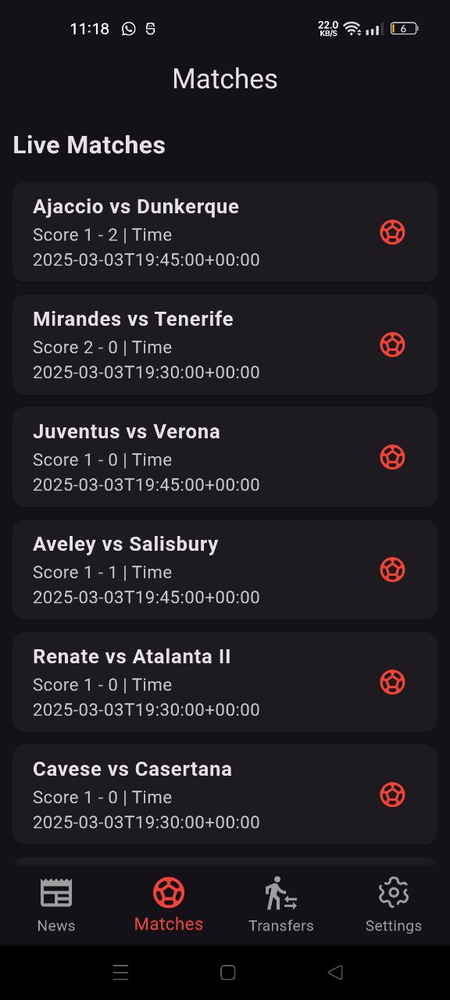

# ⚽ Elkaweer - Football News & Transfers App  

Elkaweer is a football news app that provides the latest football transfers, live scores, and match updates.  

## 📸 Screenshots  

Here are some screenshots of the app in action:  

  
  
  
  
  

## 🚀 Features  

✅ Latest football news from NewsAPI.org  
✅ Live match scores using API-FOOTBALL  
✅ Transfer updates with team and player details  
✅ Dark mode for better user experience  
✅ Multi-language support (English & Arabic)  

## 🔧 Installation  

1. Clone the repository:  
   ```sh
   git clone https://github.com/yourusername/elkaweer.git

2. Navigate to the project folder:
    ```sh
    cd elkaweer

3. Install dependencies:
    ```sh
    flutter pub get

4. Run the app
    ```sh
    Run the app

📦 Dependencies
    provider for state management
    http for API requests
    intl for date formatting
    flutter_localizations for multi-language support

📄 License
    This project is licensed under the MIT License - see the LICENSE file for details.

